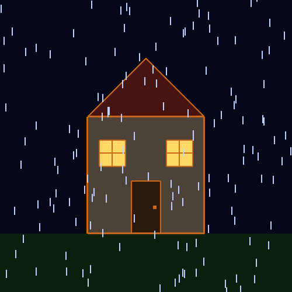

# PyOpenGL 2D Animations

Two small interactive 2D scenes written in Python with PyOpenGL and GLUT: a house standing in the rain, and a box full of bouncing, blinking points.

| House in the Rain | Amazing Box |
| :---: | :---: |
|  |  |

## Scenes

### House in the Rain

`house_in_rain.py` draws a house on a patch of grass in a steady downpour. Wind bends the rain as it falls. The sky, walls and ground shift smoothly between night and day, and the windows glow after dark.

| Key | Action |
| --- | --- |
| <kbd>←</kbd> / <kbd>→</kbd> | Bend the rain to the left / right |
| <kbd>D</kbd> | Brighten the sky, towards day |
| <kbd>N</kbd> | Darken the sky, towards night |
| <kbd>Esc</kbd> | Quit |

### Amazing Box

`amazing_box.py` turns the window into a box. Right-click to release colourful points that travel diagonally and bounce off the edges.

| Input | Action |
| --- | --- |
| Right click | Spawn a point at the cursor, moving in a random diagonal direction |
| Left click | Toggle blinking |
| <kbd>↑</kbd> / <kbd>↓</kbd> | Speed up / slow down every point |
| <kbd>Space</kbd> | Freeze / unfreeze (other controls are disabled while frozen) |
| <kbd>Esc</kbd> | Quit |

## Getting started

You need Python 3.9 or newer. The scenes were tested with Python 3.14 and PyOpenGL 3.1.10.

```bash
git clone https://github.com/tanjilaafsarirubina/pyopengl-2d-animations.git
cd pyopengl-2d-animations
python -m venv .venv
```

Activate the virtual environment with `.venv\Scripts\activate` on Windows or `source .venv/bin/activate` on macOS and Linux, then install the dependencies and run a scene:

```bash
pip install -r requirements.txt
python house_in_rain.py
python amazing_box.py
```

### Platform notes

- **Windows:** PyOpenGL 3.1.9 and later ship with freeglut, so there is nothing else to install.
- **Linux:** install freeglut from your package manager, for example `sudo apt install freeglut3-dev` on Debian/Ubuntu or `sudo dnf install freeglut` on Fedora.
- **macOS:** PyOpenGL uses the GLUT framework built into macOS. If it can't be found, install freeglut with `brew install freeglut`.

If a scene fails with `NullFunctionError: Attempt to call an undefined function glutInit`, PyOpenGL couldn't find a GLUT library. Upgrade PyOpenGL on Windows, or install freeglut as described above.

## How it works

- **Rendering:** classic immediate-mode OpenGL (`glBegin` / `glEnd`) with an orthographic 2D projection. The scenes use quads, triangles, lines, line loops and points.
- **Animation:** a GLUT timer drives the loop at about 60 frames per second. Movement is scaled by the real time between frames, so everything moves at the same speed on fast and slow machines.
- **Rain:** each drop is a short line segment that trails back along its velocity (wind, fall speed), which is what makes the rain lean in the wind. Drops that fall past the bottom are recycled at the top, and drops blown past a side edge wrap to the other side.
- **Day and night:** every colour in the house scene is a (night, day) pair, blended by the current daylight level. The rain switches between a light and a dark shade instead of blending, so it never fades into the sky at dusk.
- **Bouncing:** a point that reaches an edge is placed back on the edge and given a velocity pointing inward. Setting the direction, not just flipping it, stops points from getting stuck jittering against a wall.
- **Resizing:** the Amazing Box keeps one unit per pixel, so the box grows and shrinks with the window and mouse clicks land exactly under the cursor. GLUT reports mouse `y` from the top of the window, so it is flipped to match OpenGL's bottom-left origin.

## Project structure

```text
pyopengl-2d-animations/
├── assets/
│   ├── amazing-box.gif
│   └── house-in-rain.gif
├── amazing_box.py
├── house_in_rain.py
├── requirements.txt
└── README.md
```
